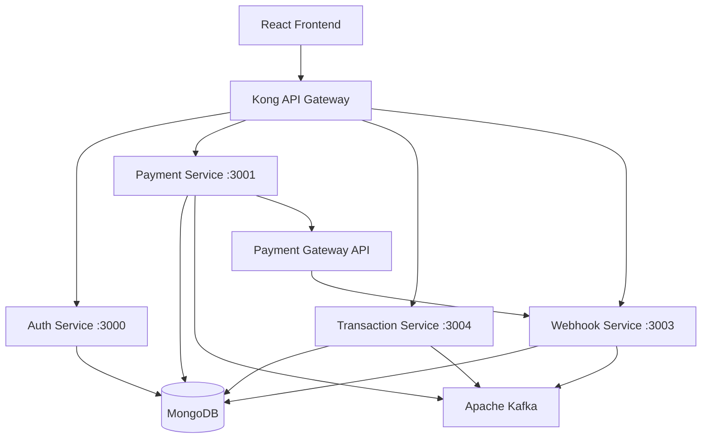

# Edviron Payments System

A microservices-based payment platform built for secure fee collection, payment tracking, and comprehensive admin/student dashboards. This project demonstrates modern distributed system architecture with event-driven communication.

[](https://opensource.org/licenses/MIT)
[](https://nodejs.org/)
[](https://www.mongodb.com/)
[](https://kafka.apache.org/)

---

## 🌟 Features

### 🎓 Student Portal
- **Secure Authentication** - Login/registration with JWT tokens
- **Payment Requests** - Create payment links for fee collection
- **Gateway Integration** - Seamless redirect to payment providers
- **Transaction History** - Real-time status tracking and payment dashboard

### 👨‍💼 Admin Dashboard
- **Analytics & Insights** - Transaction metrics by status, gateway, and date ranges
- **Advanced Search** - Filter and search transactions with multiple criteria
- **Status Management** - Real-time order status verification

### 🔧 System Features
- **Microservice Architecture** - Isolated, scalable services
- **Event-Driven Communication** - Kafka-based async messaging
- **API Gateway** - Kong-powered routing with JWT authentication
- **Data Consistency** - Idempotent transaction processing
- **Webhook Processing** - Secure signature verification

---

## 🏗️ System Architecture



### Event Flow
1. **Authentication** - Student logs in → Auth Service issues JWT
2. **Payment Creation** - Student creates payment → Payment Service calls Gateway API
3. **Event Publishing** - `payment.created` event → Kafka → Transaction Service creates view
4. **Webhook Processing** - Provider callback → Webhook Service → `payment.updated` event
5. **Real-time Updates** - Transaction Service consumes events → Dashboard reflects status

---

## ⚙️ Tech Stack

| Category | Technology |
|----------|------------|
| **Backend** | Node.js, Express.js, ES Modules |
| **Database** | MongoDB with Mongoose ODM |
| **Message Queue** | Apache Kafka (KRaft mode) |
| **API Gateway** | Kong Gateway with Docker |
| **Authentication** | JWT (Access + Refresh tokens) |
| **Frontend** | React, TailwindCSS, React Query, Recharts |
| **DevOps** | Docker, Docker Compose |
| **Utilities** | p-retry, kafkajs, dotenv |

---

## 🚀 Quick Start

### Prerequisites
- Node.js 18+
- MongoDB 6.0+
- Docker & Docker Compose
- Apache Kafka

### 1. Clone Repository
```bash
git clone https://github.com/sanjay-yadav-05/Edvrion_Payment_Integration_and-_Transaction_Analysis_Assessment.git
cd Edvrion_Payment_Integration_and-_Transaction_Analysis_Assessment
```

### 2. Install Dependencies
```bash
# Install dependencies for all services
./scripts/install-all.sh

# Or manually for each service
cd services/auth-service && npm install
cd services/payment-service && npm install
cd services/transaction-service && npm install
cd services/webhook-service && npm install
```

### 3. Environment Setup
Create `.env` files for each service:

```bash
# Copy example environment files
cp services/auth-service/.env.example services/auth-service/.env
cp services/payment-service/.env.example services/payment-service/.env
# ... repeat for other services
```

### 4. Start Infrastructure Services

#### MongoDB
```bash
# Using Docker
docker run -d --name mongodb -p 27017:27017 mongo:6.0

# Or install locally and run
mongod --dbpath /path/to/mongo-data
```

#### Apache Kafka
```bash
# Generate cluster ID
CLUSTER_ID=$(bin/kafka-storage.sh random-uuid)

# Format storage
bin/kafka-storage.sh format -t $CLUSTER_ID -c config/server.properties --standalone

# Start Kafka server
bin/kafka-server-start.sh config/server.properties
```

#### Kong API Gateway
```bash
cd infra
docker compose up -d
```

### 5. Start Application Services
```bash

# Or start individually
cd Backend/services/auth-service && npm run dev &
cd Backend/services/payment-service && npm run dev &
cd Backend/services/transaction-service && npm run dev &
cd Backend/services/webhook-service && npm run dev &
```

### 6. Access the Application
- **API Gateway**: http://localhost:8000/api/
- **Individual Services**: 
  - Auth: http://localhost:3000
  - Payment: http://localhost:3001  
  - Transaction: http://localhost:3004
  - Webhook: http://localhost:3003

---

## 📚 API Documentation

### Authentication Endpoints
| Method | Endpoint | Description |
|--------|----------|-------------|
| `POST` | `/api/auth/register` | User registration |
| `POST` | `/api/auth/login` | User login |
| `POST` | `/api/auth/refresh` | Refresh JWT token |
| `POST` | `/api/auth/logout` | User logout |

### Payment Endpoints
| Method | Endpoint | Description |
|--------|----------|-------------|
| `POST` | `/api/payments/create` | Create payment request |
| `GET` | `/api/payments/:orderId/status` | Get payment status |

### Transaction Endpoints
| Method | Endpoint | Description | Query Params |
|--------|----------|-------------|--------------|
| `GET` | `/api/transactions` | List transactions | `school_id`, `status`, `from`, `to`, `search` |
| `GET` | `/api/transactions/:orderId` | Get specific transaction | - |

### Webhook Endpoints
| Method | Endpoint | Description |
|--------|----------|-------------|
| `POST` | `/api/webhook/payment` | Payment provider callback |

---

## 📁 Project Structure

```
Edvrion_Payment_Integration_and-_Transaction_Analysis_Assessment/
├── Backend
│    ├── services/
│    │   ├── auth-service/           # Authentication & authorization
│    │   │   ├── src/
│    │   │   ├── package.json
│    │   │   └── .env.example
│    │   ├── payment-service/        # Payment processing
│    │   ├── transaction-service/    # Transaction management
│    │   └── webhook-service/        # Webhook handling
│    └── infra
│          │──kong/
│          │    ├── kong.yml               # Kong configuration
│          └── docker-compose.yaml    # Kong containerization
│
├──Frontend
│    ├──public
│    ├──.env.example
│    └── src
│    
└── README.md
```

---

## 🔧 Configuration

### Environment Variables

Each service requires specific environment variables. Example for Payment Service:

```env
# Server Configuration
PORT=3001
NODE_ENV=development

# Database
MONGO_URI=mongodb://127.0.0.1:27017/Edviron_DB

# JWT Configuration
JWT_ACCESS_SECRET=your_access_secret_here
JWT_REFRESH_SECRET=your_refresh_secret_here

# Kafka Configuration
KAFKA_BROKERS=localhost:9092
KAFKA_CLIENT_ID=payment-service

# Payment Gateway
PG_API_URL=https://api.edviron.com
PG_API_KEY=your_api_key_here
PG_WEBHOOK_SECRET=your_webhook_secret
```

---

## 🧪 Testing

```bash
# Run tests for all services
npm run test

# Run tests for specific service
cd services/auth-service
npm run test

# Run integration tests
npm run test:integration
```

---

## 🚧 Development

### Adding New Features
1. Create feature branch: `git checkout -b feature/new-feature`
2. Implement changes in relevant microservice
3. Add tests and documentation
4. Submit pull request

### Code Style
- ESLint configuration provided
- Prettier for code formatting
- Commit messages follow conventional commits

```bash
# Lint code
npm run lint

# Format code
npm run format
```

---

## 📈 Monitoring & Logging

- **Logging**: Winston-based structured logging
- **Health Checks**: `/health` endpoints on each service
- **Metrics**: Application performance monitoring ready

---

## 🤝 Contributing

1. Fork the repository
2. Create your feature branch (`git checkout -b feature/AmazingFeature`)
3. Commit your changes (`git commit -m 'Add some AmazingFeature'`)
4. Push to the branch (`git push origin feature/AmazingFeature`)
5. Open a Pull Request

---

## 📄 License

This project is licensed under the MIT License - see the [LICENSE](LICENSE) file for details.

---

## 🙏 Acknowledgments

- Built as part of the Edviron technical assessment
- Demonstrates modern microservices architecture patterns
- Event-driven design principles

---

## 📞 Support

For questions or support, please open an issue on GitHub or contact the development team.

**Happy Coding! 🚀**
